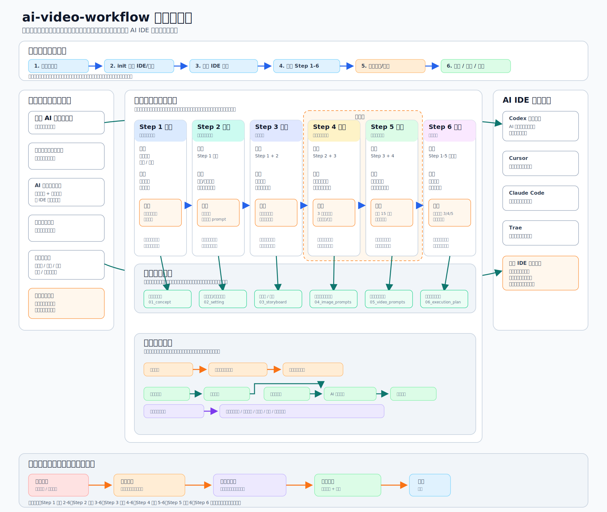

# 工作流系统图

本文面向想理解、试用或参与开发 `ai-video-workflow` 的同学。它不替代正式规范；正式规则仍以 `packs/official-ai-video/workflow/workflow-spec.md`、`packs/official-ai-video/workflow/quality-gates.md` 和各步骤 skill 为准。



## 读图方式

这张图默认按“第一次看到项目的人也能读懂”的方式设计：大字说明业务产物和流程，小字只补充开发落位。读图时不要先看目录名，先看每一步在创作和生产里承担什么责任。

这张图分成七层：

1. 顶部是用户使用项目的路径：安装、初始化、同步 IDE 运行规则、推进六步流程、校验诊断、交付或回流。
2. 左侧是产品与工具层：官方 pack、规则、skills、模板、CLI 和 checks。
3. 中间是 Step 1 到 Step 6 的创作与生产链路。每一步先展示输入、创作动作和审核门槛。
4. 步骤下方是独立的六步产物卡片。每个产物都用连线接回上方对应步骤，避免把“流程动作”和“交付物”挤在同一个框里。
5. 产物卡片下方是生成执行关系卡片。它单独表达设定素材、图片提示词、视频提示词、AI 视频平台和生产执行统筹之间的流向。
6. 右侧是 AI IDE 运行入口：Codex、Cursor、Claude Code、Trae 的入口不同，但不应形成第二套工作流。
7. 底部是修改传播闭环：上游内容一旦变更，必须做影响分析、同步下游一致性、重新审核，再进入锁版。

## 术语翻译

图里尽量避免直接暴露仓库内部文件名。仍然出现的少量英文或技术词，可以按下面理解：

| 图上术语 | 给路人的解释 | 开发落位 |
| --- | --- | --- |
| 官方 pack | 一套可复用的 AI 视频创作规则、模板和检查标准 | `packs/official-ai-video/` |
| AI 助手执行能力 | 告诉 AI IDE 每一步应该怎么做的技能说明 | `skills-longform/` 和 `skills/*/SKILL.md` |
| 每步交付模板 | 规定每一步最终应该产出什么文档 | `templates/` |
| 自动检查规则 | 用来发现结构、链接、提示词合同和同步问题的检查逻辑 | `checks/` 与 CLI 校验 |
| IDE 运行入口 | 把同一套工作流同步到 Codex、Cursor、Claude Code、Trae 等工具里 | 各 IDE 的运行目录 |
| 落位 | 这个产物在项目目录里通常放在哪里 | 例如 `03_storyboard/` |

## 用户使用过程

用户第一次使用时，先运行安装和构建命令，然后通过 CLI 初始化项目。初始化时会选择目标 IDE、默认图片平台和默认视频平台。项目生成后，CLI 会把 `official-ai-video` pack 的 skills、模板、索引和运行规则同步到对应 IDE 的运行目录。

随后用户从 Step 1 开始推进项目。每一步不是随手写一个文件，而是围绕一个稳定产物完成：先读取上游输入，再生成当前步骤内容，再按质量门槛审核，必要时回改。进入 Step 6 后，项目会把前五步产物转成可执行、可分发、可追踪的生产清单。

在多人协作时，Step 6 不只是清单，而是生产总控层。它需要记录执行人、覆盖范围、预计数量、样张状态、批量放行状态和回传位置。复杂项目还应补充锚点统筹、锁版清单和状态回报。

## 六步产物关系

| 步骤 | 上游输入 | 当前动作 | 核心审核 | 正式产物 |
| --- | --- | --- | --- | --- |
| Step 1 策划 | 用户意图、题材、目标 | 建立故事、视觉和生产基线 | 不越级写设定、分镜或 prompt | 故事内核、原始剧本、约束条件 |
| Step 2 设定 | Step 1 | 建立角色母本、场景母本和一致性锚点 | 不拆镜头、不写最终 prompt | 设定素材、一致性锚点 |
| Step 3 分镜 | Step 1 + Step 2 | 拆成一镜一卡，必要时写帧级状态映射 | 主描述以可见事实为主，不用主题解释替代镜头事实 | 分镜卡、镜头总表、帧级映射 |
| Step 4 图片提示词 | Step 2 + Step 3 | 把每个关键帧写成自足可生图 prompt | 保持 Step 3/4 帧级对齐，固定三个区块，不写“同上” | 图片提示词 Markdown |
| Step 5 视频提示词 | Step 3 + Step 4 | 基于关键帧写连续动作段 | 默认单镜、默认 15 秒内，重述关键连续性 | 视频提示词 Markdown |
| Step 6 执行方案 | Step 1 到 Step 5 完成态 | 汇总任务、缺口、阻塞、分发和放行条件 | 能追溯到 Step 3/4/5，不偷改上游创作正文 | 生产执行统筹单、图片执行单、视频执行单 |

Step 3 和 Step 4 是全流程里最容易漂移的地方。Step 3 给人读，允许说明镜头功能；Step 4 给模型读，必须只写完整画面事实。两者必须指向同一个稳定状态。

Step 2 的角色、场景和锚点设定不是一次性背景资料。它们会成为大部分图片生成的基础素材，也会在后续视频生成中承担一致性素材的作用。换句话说，设定阶段确认的角色外观、空间关系、道具和关键视觉锚点，会持续约束 Step 3 分镜、Step 4 图片提示词和 Step 5 视频提示词。

Step 4 和 Step 5 的关系也很关键。Step 5 默认消费 Step 4 的 `English Version (Copy Ready)`，但不能只写“沿用上一张图”。视频提示词必须重述当前段所需的连续性变量。

实际生成时，Step 4 的图片提示词先用于生成关键帧图片。这些图片结果会和 Step 5 的视频提示词一起进入 AI 视频平台，用于生成视频片段。Step 6 的生产执行单则负责整体生成工作的统筹，包括图片批次、视频批次、执行人、回传位置、样张状态和批量放行状态。

Step 6 负责执行追踪和生成统筹，不负责偷偷重写前面五步。如果 Step 6 发现上游内容缺失或互相矛盾，应把问题回报到对应步骤，而不是在执行单里私自补造事实。

## 审核与修改传播

每一步完成后都应进入审核。审核有两类：

- 人审：检查叙事、画面、生产可执行性和协作分配是否成立。
- 工具审：通过 `verify`、`doctor` 或后续 checks 检查结构、文件合同、相对链接和 IDE 运行目录同步。

修改传播规则如下：

| 修改位置 | 默认影响范围 | 典型处理 |
| --- | --- | --- |
| Step 1 被修改 | Step 2 到 Step 6 | 重新检查设定、分镜目标、提示词基线和执行清单 |
| Step 2 被修改 | Step 3 到 Step 6 | 重新检查角色、场景、锚点和画面连续性 |
| Step 3 被修改 | Step 4 到 Step 6 | 重新检查关键帧、视频动作链和执行映射 |
| Step 4 被修改 | Step 5 到 Step 6 | 重新检查视频提示词和图片执行单 |
| Step 5 被修改 | Step 6 | 重新检查视频执行单、阻塞项和放行状态 |
| Step 6 被修改 | 通常不反写上游 | 只更新执行状态；发现创作问题时回报给对应上游步骤 |

增强流程默认开启时，每次正式回复还应带状态回报，说明当前步骤、输入来源、输出位置、待确认项和下游影响。这样多人协作时不会只留下结果，却丢掉过程决策。

## 产品模块关系

`official-ai-video` 是默认官方 pack。它是规则、模板、skills、checks 和 IDE adapter 的母版来源。CLI 负责把这套母版落到具体项目里，并提供初始化、同步、校验、诊断和创建新 pack 的入口。

IDE 运行目录只是落位方式，不是第二套规则。Codex 使用 `.codex/skills/` 作为技能入口，同时保留 `.codex/ai-video-workflow/` 作为完整运行镜像。Cursor、Claude Code 和 Trae 有各自入口，但都应从同一份 pack 同步，不应自行发明不同规则。

## 适合继续开发的方向

后续可以按模块分工：

- CLI：补非交互参数、发布流程、端到端测试、错误提示。
- Checks：补 Step 3/4 帧级对齐检查、Step 4 文本质量检查、相对链接检查。
- Workflow pack：继续打磨六步规则、模板、状态回报和增强流程。
- IDE adapters：完善 Codex、Cursor、Claude Code、Trae 的同步策略和使用说明。
- Demo project：做一个可公开、可 verify、可从 Step 1 跑到 Step 6 的完整短片示例。
- Docs：把用户路径、贡献者路径、pack 创作者路径拆开，降低新同学进入成本。

## 给生图模型的美化提示词

如果要把当前 SVG 再做成适合朋友圈传播的视觉海报，可以把下面提示词交给生图模型。注意：生图模型容易把中文和细节文字画错，建议让模型生成背景、层级和视觉风格，最终文字仍用 SVG、Figma 或 Excalidraw 手动覆盖。

```text
生成一张专业的开源项目流程信息图，主题是“AI 视频创作工作流系统”。画面采用横向 16:9 架构图布局，清晰分成七层：顶部是用户使用路径，左侧是可复用创作规则包与命令行工具，中间是 Step 1 策划、Step 2 设定、Step 3 分镜、Step 4 图片提示词、Step 5 视频提示词、Step 6 执行方案六个并列流程卡片，步骤卡片下方有一张独立的“六步产物卡片”，每个产物用线连接到上方对应步骤。产物卡片下方再单独开一张“生成执行关系”卡片，用水平流程线体现：设定素材支撑大部分图片生成并作为后续视频一致性素材，图片提示词生成的图片加视频提示词进入 AI 视频平台生成视频，生产执行单用于统筹整体生成工作。右侧是 Codex、Cursor、Claude Code、Trae 等 AI IDE 的运行入口，底部是审核、修改、影响分析、一致性修正、重新审核、锁版的闭环。

视觉风格：现代技术产品架构图，白色和浅灰背景，蓝色、青绿色、橙色作为强调色，清晰网格、圆角卡片、细线箭头、轻微阴影，适合朋友圈分享和项目招募。大字使用路人能看懂的人话标签，小字只作为开发落位提示。不要画人物，不要装饰性插画，不要复杂背景，不要生成密集小字，不要在图片底部加 Source 行。保留大量干净的文字占位区域，方便后期用真实文字覆盖。
```

## 相关阅读

- [工作流总览](../workflow/overview.md)
- [Step 3 分镜](../workflow/step-03-storyboard.md)
- [Step 4 图片提示词](../workflow/step-04-image-prompts.md)
- [Step 6 执行方案](../workflow/step-06-execution-plan.md)
- [测试](./testing.md)
